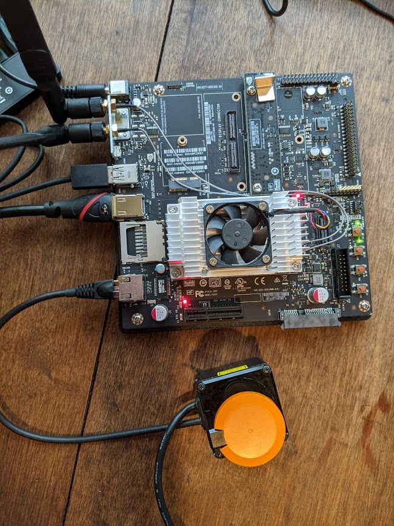
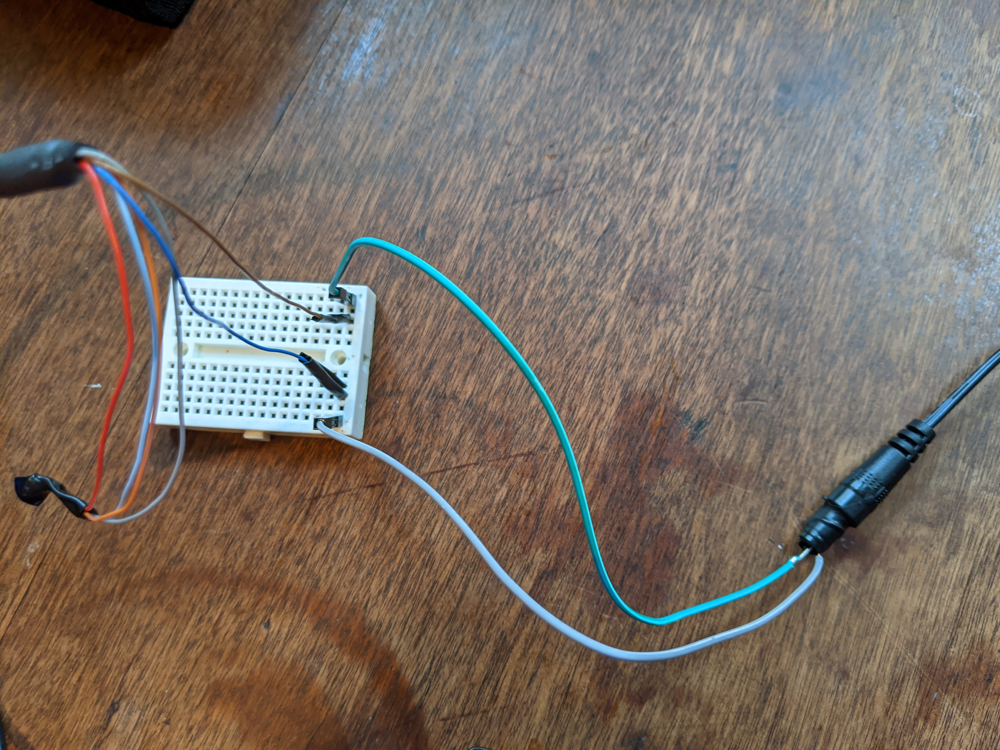
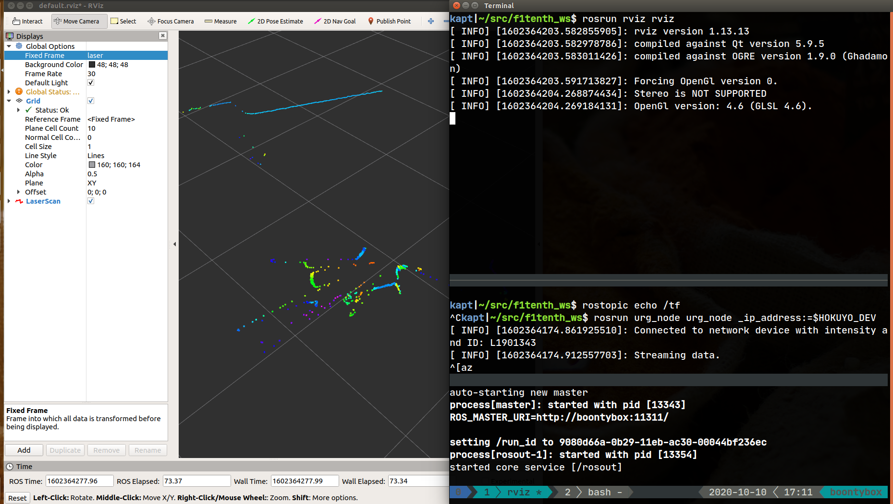

# Instructions for integrating Hokuyo UST-10LX with NVIDIA Jetson TX2



## References
- https://f1tenth.readthedocs.io/en/latest
- https://wiki.ros.org/melodic/Installation/Ubuntu
- https://www.jetsonhacks.com/2018/02/21/racecar-j-hokuyo-ust-10lx-configuration/

## Required hardware components
- Hokuyo UST-10LX 2D LiDAR sensor
- NVIDIA Jetson TX2 Developer Kit
- 12V Power supply for LiDAR

## NVIDIA Jetson TX2 Software
- Power Jetson TX2 carrier board using the included power supply
- Install the recommended Ubuntu 18.04
- Install Robot Operating System (ROS) Melodic, and the `ros-melodic-driver-base` package using `apt`

## Setup the f1tenth workspace
- Create a root directory for the f1tenth workspace. For the purposes of demonstration this document will use `f1tenth_ws`.
- Clone the `f1tenth_system` Git repo into `f1tenth_ws/src/f1tenth_system`:
  ```
  git ​clone​ https://github.com/f1tenth/f1tenth_system f1tenth_ws/src/f1tenth_system
  ```
- Make all Python scripts executable:
  ```
  cd f1tenth_ws
  find . -name “*.py” -exec chmod +x {} \;
  ```
- Build the project
  ```
  catkin_make
  ```
- Setup the environment for your shell (Bash is default, and recommended)
  ```
  source devel/setup.bash
  ```

## Hokuyo LiDAR sensor connection
- Strip the brown (DC in) and blue (ground) wires from the LiDAR 5-pin connector and power them using a wall adapter or suitable power supply. Below is a temporary jank example using a 12V barrel plug. Be very careful to get the positive and ground connections right.

  

- Configure the TX2 eth0 interface as follows:
  ```
  auto eth0
  iface eth0 inet static
  address 192.168.0.15
  netmask 255.255.255.0
  gateway 192.168.0.1
  ```
- Save the IP address of the Hokuyo device to an environment variable
  ```
  export HOKUYO_DEV=192.168.0.10
  ```
- Connect the ethernet cable to the TX2 board and connect the eth0 interface. Make sure that the lidar is reachable
  ```
  ping $HOKUYO_DEV
  ```

- Edit the f1tenth workspace configuration files for the Hokuyo device
  - Locate and modify the `sensors.launch.xml` file and change the `hokuyo_node` node entry to `<node pkg="urg_node" type="urg_node" name="laser_node" />` and set the port entry to `<param name="port" type="string" value="192.168.0.10"/>`
  - Locate and modify the `sensors.yaml` file and replace the `laser_node` `device` entry with `ip_address: 192.168.0.10`

## Visual LiDAR Test
- Execute `roscore` from the `f1tenth_ws` dir
- From another terminal window, start the `urg_node` for the Hokuyo device
  ```
  rosrun urg_node urg_node _ip_address:=$HOKUYO_DEV
  ```
- From another terminal window, check that the sensor data from the Hokuyo LiDAR is being published to the `/scan` topic
  ```
  rostopic echo /scan​
  ```
- If that works, start the `rviz` node
  ```
  rosrun rviz rviz
  ```
- In the rviz application, modify the `Fixed Frame` entry to "laser", then add a new display by topic using the "/scan" topic. It should look like the following:

  
