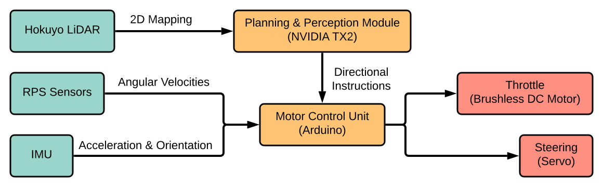

# Overview

The major sensor and compute components are shown in the block diagram above. The compute nodes are run on the NVIDIA TX2 and the motor control unit (MCU). The LiDAR, RPS sensors, and inertial measurement unit (IMU) are sensors that provide the view of the environment and the orientation of the vehicle within it. The throttle and steering are motors that act as the source of movement through the environment.

The primary method of communication between devices is the Robot Operating System (ROS) middleware. The ROS itself provides an interface for messaging based on publish-subscribe topics. The ROS nodes above are connected physically,via USB serial for the directional instructions and via Ethernet for the 2D mapping. Other connections between the MCU microcontroller, sensors, and motors are outside of the ROS network.

The NVIDIA Jetson TX2 runs a modified Ubuntu Linux distribution. It serves as the core of the ROS network, where quality of service guarantees are maintained between the nodes on the network. The Jetson TX2 also acts as the interface between the LiDAR module and the MCU. LiDAR scan frames are transmitted over an ethernet network interface and passed through a pathfinding algorithm. After the path is determined, the desired heading and velocity are sent to the MCU over a serial connection.
