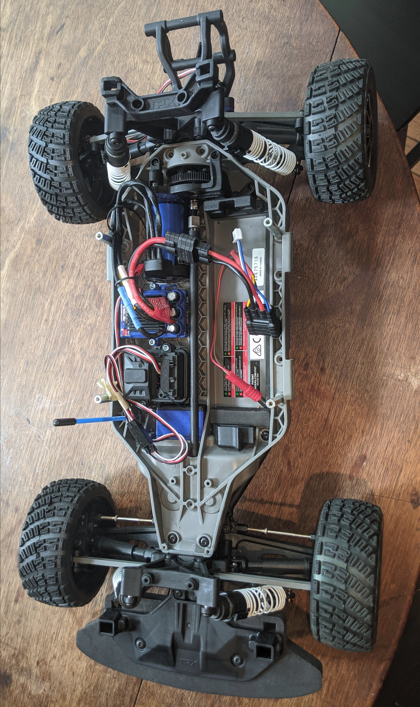

# Physical Layout & Manual Control

  
  

## Chassis & Stock Components (left figure above)

The stock components mounted on the chassis of the vehicle, shown above on the left, from top to bottom of vehicle:
1. Velineon 3500 4-pole brushless DC motor
2. Velineon VXL-3s electronic speed controller (ESC)
3. RC receiver box
4. RC antenna
5. Steering servo

These, and the Traxxas 5000mAh 3S 11.1V LiPo Battery Pack are the components necessary to control the vehicle manually via the Joystick. To start the vehicle in this configuration, simply connect the battery and press the "EZ Set" button on the ESC. You should see a solid green light after the button is pressed. Consult [the manual](traxxas-ford-fiesta-st-rally-manual.pdf) for details. We recommend setting the ESC to "Training Mode".

## Compute Modules & Power Board (right figure above)

The Jetson TX2 and sensor board (MCU/IMU) are mounted above the retention bracket of the battery. There should be a USB connection to the MCU (Arduino microcontroller) and an Ethernet connection to the LiDAR.

The power board is mounted to the under-side of the rear segment of the shell.
Make sure the power board is switched off while attaching the output jumper wires to all compute modules and then inserting the barrel plug from the battery wire. Please consult the [power board schematic](power.md) and [sensor board schematic](sensor-board.md) when making connections. 12V power terminals should be connected to the TX2 and LiDAR. 5V power terminals should be connected to the sensor board power input pins.

## Shell

Only the rear shell segment is necessary for running the whole vehicle, though excluding the rest will degrade aerodynamic performance.

  
  

## TODO:
- Shell mounting
- Mounting hardware (standoffs, screw & wrench sizes, etc.)
