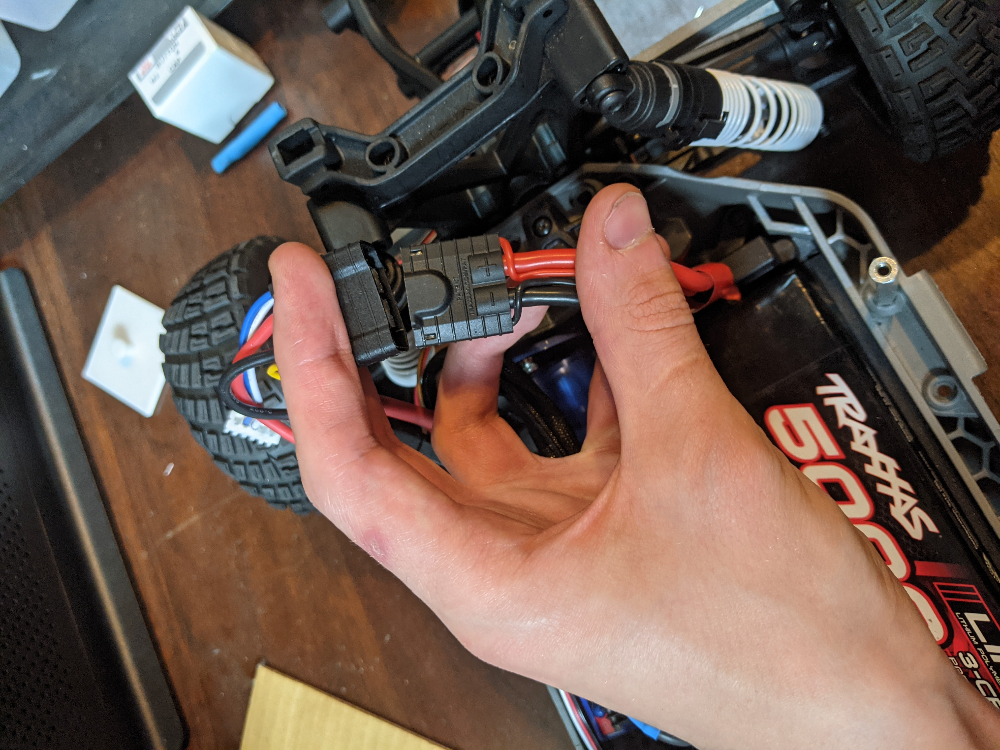

# Power Delivery

All components of the vehicle are powered by a Traxxas 5000mAh 3S 11.1V LiPo Battery Pack. __Be very careful when handling the LiPo battery. Never plug it in the wrong way or leave it plugged in while unattended.__

The battery directly powers the Velineon VXL-3s electronic speed controller (ESC). An additional 2.1mm barrel plug to a power board that distributes power to the other devices. This power board is controlled by a switch protruding from the rear segment of the shell on which it is mounted.

It is important to note that both the ESC and the power board must be switched off to prevent the battery from discharging. Though it is recommended to unplug the battery as well when the vehicle is not in use.

Only the ESC is necessary to control the car manually with the included RC joystick. However, the throttle and steering ribbon cables must be connected to the labeled ribbon cables protruding from the radio receiver box between the ESC and the radio antenna.

Below is the schematic for the power board and a photo of the soldered perfboard implementation installed in the car. The top 3 terminals deliver 5V, and are currently used to power the RPS sensors and steering servo. The bottom two terminals deliver 12V, and is are currently used to power the Jetson TX2 and the LiDAR.

  
  

## Recommended improvements

- It would be more energy efficient to replace the linear voltage regulator with a buck converter. This would be especially important if more than 300mA is drawn from the 5V outputs at any time, since the transistor has no heat sink and would begin putting out a lot of head and possibly trigger its internal safety cutoff. Even if less current is drawn, which should currently be the case, a buck converter would increase battery life by decreasing the wasted energy converted to heat.

- All circuit boards created by soldering onto perfboard should be recreated on printed circuit boards.
