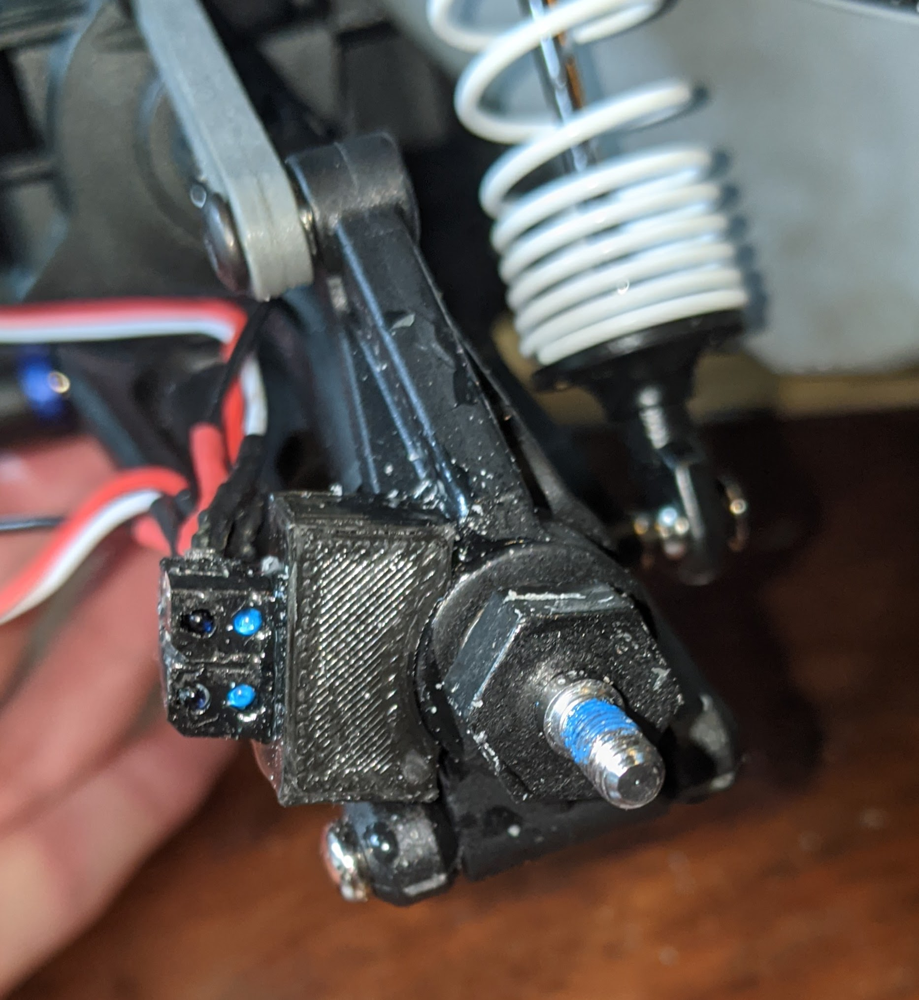
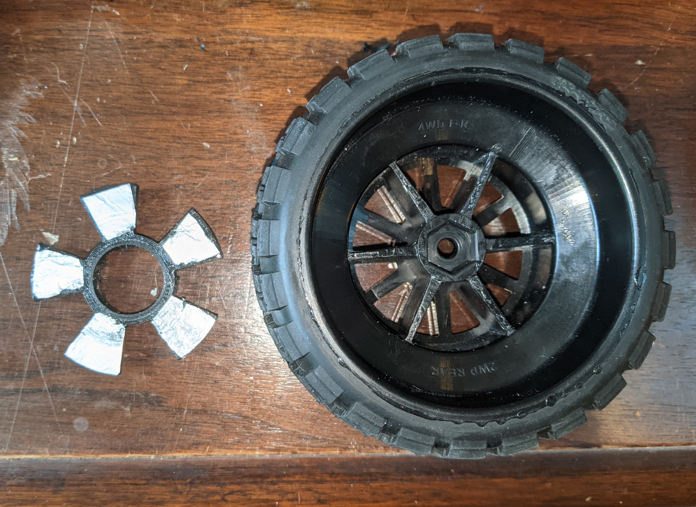
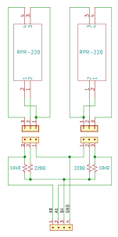

# RPS Sensors

One set of RPS sensors are currently attached to the rear-right wheel mount. These provide feedback to the MCU in the form of angular velocity of the wheel in revolutions per second. The pair of sensors detect the reflection of ultraviolet light from the spokes of a reflective encoder plate mounted between the wheel and the sensors.

  
  

Two RPR-220 optical sensors are used in order to detect the direction of rotation. For these sensors, a low analog output signal implies that the phototransistor is receiving the ultraviolet light emitted from that sensor. The direction of rotation is determined by which sensor experiences a rising edge after they are both set low simultaneously by the reflective encoder wheel spoke.

The schematic below shows the curcuit connections necessary between the RPS sensors and the MCU microcontroller. On the 4-pin header, 5V and ground are supplied from the power board and the analog pins A0 and A1 are connected to analog input pins on the MCU board.

## TODO:
- diagram of encoder wheel, showing sensor/spoke spacing
