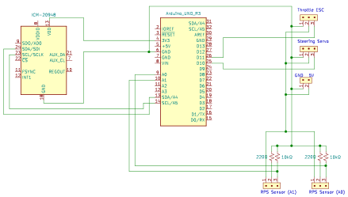
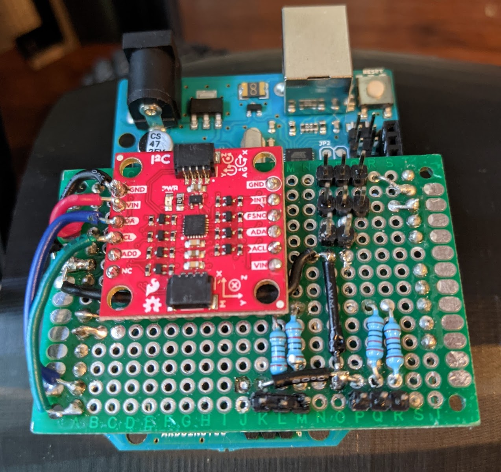

# Sensor Board (MCU & IMU)

  
  

The SparkFun ICM-20948 inertial measurement unit (IMU) and pinouts are soldered onto a perfboard that is connected to the IO pins of the Arduino microcontroller. The schematic above corresponds to the perfboard circuit. All ground connections are placed on the left side (from the perspective of the above images) and exposed as black wires on the top layer for quick reference when making connections. If RPS sensors read reversed results (like negative values when wheels rotate forwards) then just swap their connections on this board to correct them.
