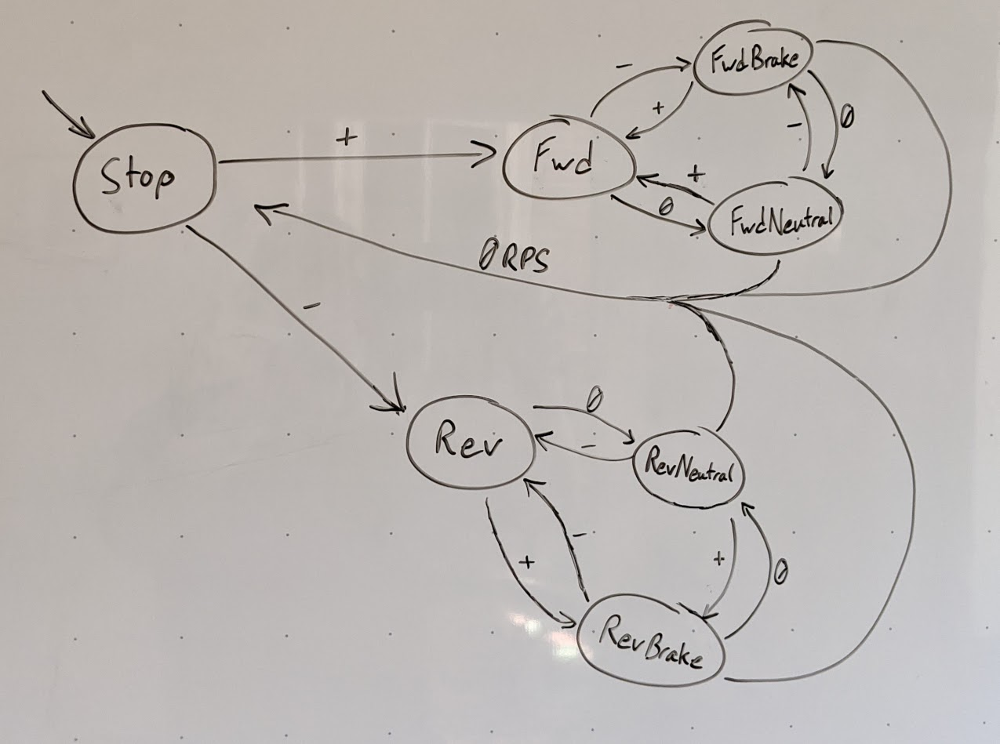

# Throttle Control

The brushless DC motor driving the wheels of the vehicle is not controlled directly from the MCU. Instead, the MCU controls an electronic speed controller (ESC) which provides a simplified abstraction over the complex details of controlling the individual electromagnets within the motor. The ESC is controlled like a servo motor with a range of approximately 30° to 150°, where 90° is neutral. The MCU further simplifies this model such that 0° is neutral and the range is ±60°. Throttle adjustments to the ESC only change at increments of 5% of the 120° range, which is 6°.

The remainder of this document will be using the MCU's abstraction of throttle control unless otherwise specified. So positive angles correspond to forward throttle, and negative angles correspond to reverse throttle.

## Braking

The ESC on its own does not smoothly transition from forward throttle to reverse or vice versa. Instead, if the MCU has set the throttle to +12° and then switches the throttle to -12°, then the ESC will enter an automatic braking sequence where it stops the rotation of the motor. The ESC in this state will not then reverse the motor until the motor is no longer spinning, the throttle is switched back to its neutral position, and then the throttle control is switched back to a negative angle.

This is why the MCU provides an abstraction over throttle control, in [throttle.hh](https://github.com/drexel-f1tenth/motor-control/blob/main/mcu/throttle.hh), where braking and reversing are handled automatically. This is especially important when considering that the angular velocity of the motor does not really correspond to the velocity of the wheels nor the velocity of the car. This is why modern vehicles use anti-lock braking systems (ABS) instead of just stopping rotation.

Below is a whiteboard drawing of the state machine implemented in the MCU to handle this behavior of the ESC.

